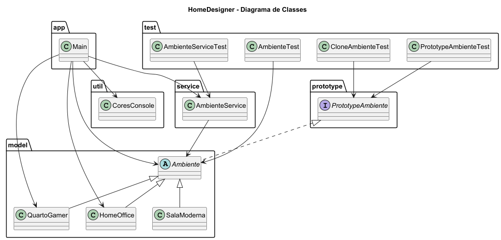

# HomeDesigner

Sistema inteligente de decoração de ambientes desenvolvido em Java utilizando o padrão de projeto Prototype.

O projeto simula um aplicativo moderno de design de interiores permitindo clonar ambientes previamente configurados para agilizar personalizações.

---

# Padrão de Projeto Utilizado

## Prototype

O padrão criacional Prototype foi utilizado para criar novos objetos através da clonagem de instâncias existentes.

### Estrutura do padrão no projeto

| Papel | Classe |
|---|---|
| Prototype | PrototypeAmbiente |
| ConcretePrototype | QuartoGamer, HomeOffice, SalaModerna |
| Client | AmbienteService |

---

# Diagrama de Classes



---

# Funcionalidades

- Criação de ambientes
- Clonagem de ambientes
- Personalização rápida
- Reutilização de objetos
- Simulação de decoração
- Interface via console

---

# Estrutura do Projeto

```text
HomeDesigner/
│
├── src/
│   ├── main/
│   │   ├── app/
│   │   │   └── Main.java
│   │   │
│   │   ├── model/
│   │   │   ├── Ambiente.java
│   │   │   ├── QuartoGamer.java
│   │   │   ├── HomeOffice.java
│   │   │   └── SalaModerna.java
│   │   │
│   │   ├── prototype/
│   │   │   └── PrototypeAmbiente.java
│   │   │
│   │   ├── service/
│   │   │   └── AmbienteService.java
│   │   │
│   │   └── util/
│   │       └── CoresConsole.java
│   │
│   └── test/
│       ├── AmbienteTest.java
│       ├── AmbienteServiceTest.java
│       ├── PrototypeAmbienteTest.java
│       └── CloneAmbienteTest.java
│
├── docs/
│   ├── diagrama-classe.puml
│   └── diagrama-classe.png
│
├── README.md
│
└── .gitignore
```

---

# Tecnologias Utilizadas

- Java 17
- IntelliJ IDEA
- JUnit 5
- PlantUML
- Git

---

# Execução do Projeto

## Executando a aplicação

Execute a classe principal:

```text
src/main/app/Main.java
```

Ou execute pelo terminal:

```bash
javac src/main/app/Main.java
java src/main/app/Main
```

---

# Execução dos Testes

Os testes automatizados estão localizados em:

```text
src/test
```

## Executando no IntelliJ

- Clique com o botão direito na pasta `test`
- Selecione:
Run Tests

---

# Casos de Teste Implementados

## AmbienteTest

- Criação de ambientes
- Verificação de atributos

## PrototypeAmbienteTest

- Clonagem de ambientes
- Verificação de objetos distintos

## CloneAmbienteTest

- Clonagem de home office
- Validação de objetos clonados

## AmbienteServiceTest

- Cadastro de ambientes
- Manipulação da lista

---

# Exemplo de Funcionamento

```text
Ambiente: Quarto Setup RGB | Estilo: Gamer

Ambiente: Quarto Setup RGB | Estilo: Gamer

Ambiente: Escritório Executivo | Estilo: Minimalista
```

---
